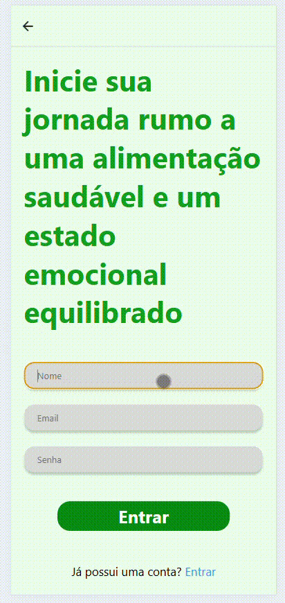
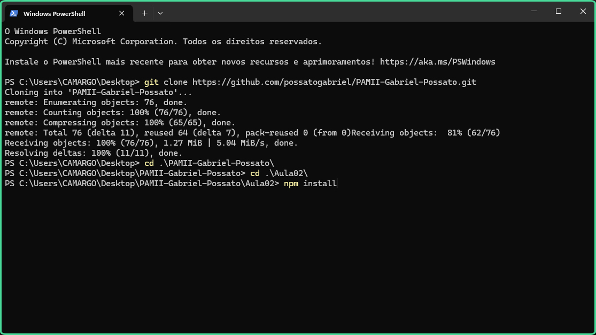
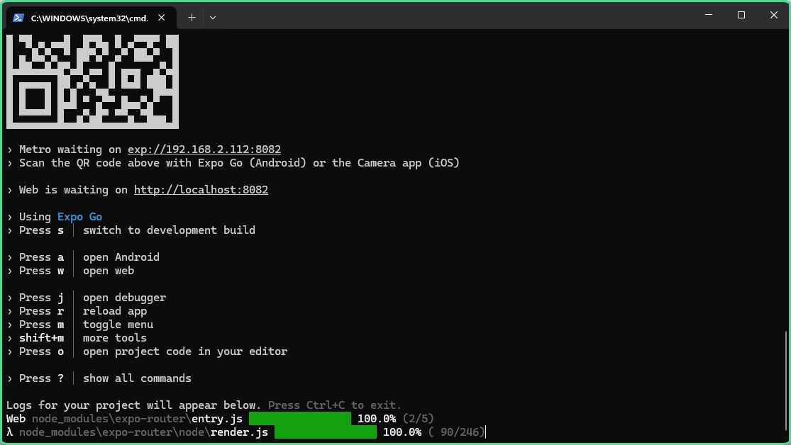

# 🍇 TCC



## 📰 Descrição

Repositório do projeto de TCC

## 💻 Tecnologias Utilizadas
`Trabalhado durante o projeto:`

  
          
## 🛠️ Como executar o programa

* Passo 1: Copie o link do repositório ***(clique em "Code")***


* Passo 2: Utilizando o <a href = "https://www.apachefriends.org/pt_br/index.html">Xampp</a>, inicie o servidor **Apache e MySQL *(clique em "Start")***


* Passo 3: Abra a pasta **"htdocs" (atalho no botão "Explorer")**


* Passo 4: **Abra a pasta com o Terminal** *(clique com o botão direito)* e clone o repositório ***(cole o código abaixo)*** 


```COLE O CÓDIGO: git clone https://github.com/possatogabriel/TCC.git```

* Passo 5: Após isso, **abra o MySQL e execute o arquivo SQL do projeto**


- Passo 6: Na pasta do projeto, **instale o "npm" pelo terminal *(cole o código abaixo)***


```COLE O CÓDIGO: npm install```

- Passo 7: Após a instalação, **inicie o projeto *(cole o código abaixo)***


```COLE O CÓDIGO: npm start```

- Passo 8: Abra o projeto no seu navegador de preferência ***(aperte "W" para abrir no navegador padrão do sistema ou cole o link na barra de busca)***


```COLE O CÓDIGO: http://localhost:8081```

## 🙋 Autores
| [ <br> <sub> Gabriel Possato </sub>](https://github.com/possatogabriel) | [<br><sub> Adilson Kina </sub>](https://github.com/Adilson-kina) | [ <br> <sub> Paulo </sub>](https://github.com/Paulinho598) |
| :---: | :---: | :---: |
<br>
<br>
<p align = "center">  <br/>  </p>
