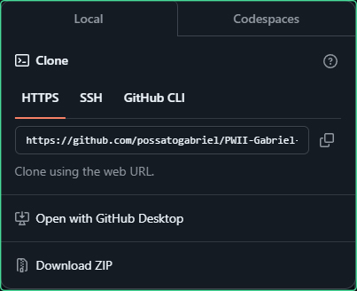
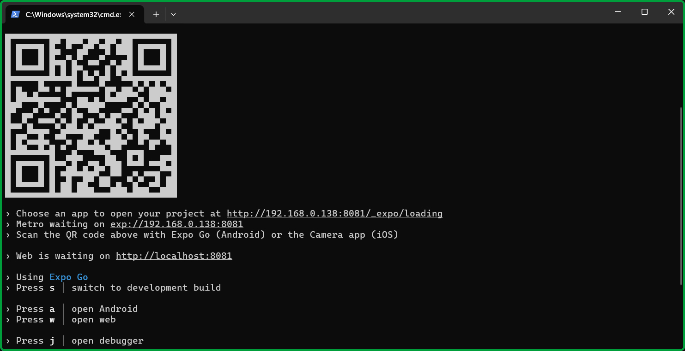
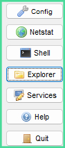
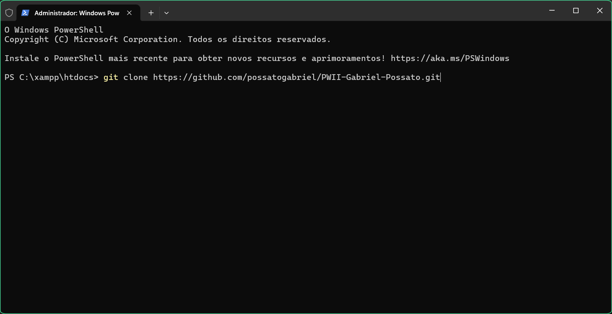
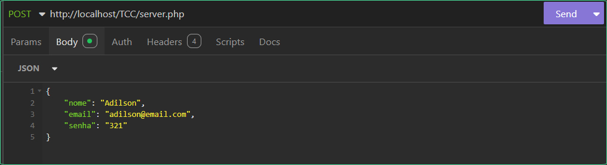
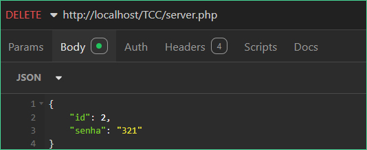

# 🍇 TCC

## 📰 Descrição

Repositório do projeto de TCC

## 💻 Tecnologias Utilizadas
`Trabalhado durante o projeto:`


          
## 🛠️ Como executar o programa

* Passo 1: Copie o link do repositório ***(clique em "Code")***



* Passo 2: Utilizando o <a href = "https://www.apachefriends.org/pt_br/index.html">Xampp</a>, inicie o servidor **Apache *(clique em "Start")***


* Passo 3: Abra a pasta **"htdocs" (atalho no botão "Explorer")**



* Passo 4: **Abra a pasta com o Terminal** *(clique com o botão direito)* e clone o repositório ***(cole o código abaixo)*** 


```COLE O CÓDIGO: git clone https://github.com/possatogabriel/TCC.git```

* Passo 5: Agora, utilizando uma ferramenta de requisições HTTP, **envie uma do tipo POST ou DELETE para a url do arquivo PHP**
    * Passo 5.1: Para **requisições do tipo "POST", *coloque as informações no corpo em JSON*** 


```COLE O CÓDIGO: http://localhost/TCC/server.php```

    


```COLE O CÓDIGO: {"nome": "Seu Nome", "email": "seuemail@email.com"}```

## 🙋 Autores
| [ <br> <sub> Gabriel Possato </sub>](https://github.com/possatogabriel) | [<br><sub> Adilson Kina </sub>](https://github.com/Adilson-kina) | [ <br> <sub> Paulo </sub>](https://github.com/Paulinho598) |
| :---: | :---: | :---: |
<br>
<br>
<p align = "center">  <br/>  </p>
